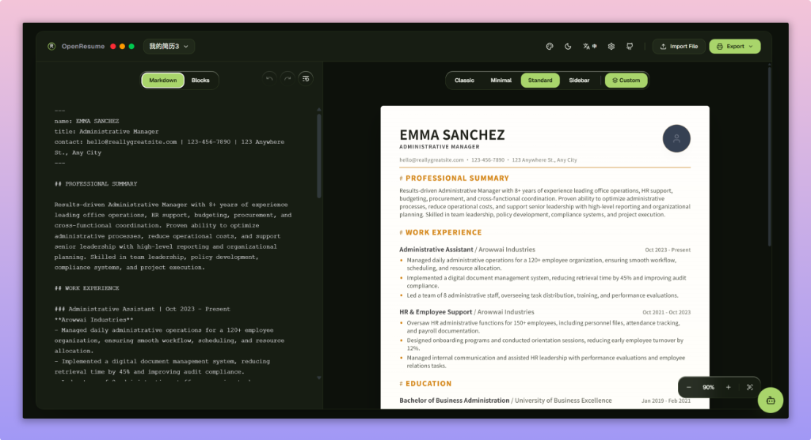

# openResume

A local-first resume workspace with Markdown editing, block editing, A4 live preview, an AI resume assistant, and export to PDF / Word / HTML.

[中文](./README.md) | [English](./README.en.md)

Live Demo: [https://open-resume-dun.vercel.app/](https://open-resume-dun.vercel.app/)

GitHub: [https://github.com/jonbrown66/openResume](https://github.com/jonbrown66/openResume)



## Features

- Dual editing modes: Markdown and block editor
- Unified A4 canvas for both editing and preview
- Zoomable preview with template switching and style controls (built-in fonts including Geist, Fira Mono, GenSenRounded, TW-Sung, TW-Kai, etc. with font fallback system)
- Import support for `md / txt / pdf / docx`
- Local fallback parsing when no API key is configured
- AI-assisted resume editing with before/after diff preview
- Project-scoped assistant memory with a default limit of 20 recent messages
- Export to `PDF / DOCX / HTML`
- Local multi-project resume management with optimized mobile layout and UI details
- Support for OpenAI, Anthropic, Gemini, DeepSeek, and OpenRouter (supports custom models and connectivity test)

## Tech Stack

- Next.js 15
- React 19
- TypeScript
- Tailwind CSS 4
- Framer Motion
- Vitest
- `pdfjs-dist`
- `mammoth`
- `docx`
- Puppeteer / Chromium

## Local Development

Recommended with `pnpm`:

```bash
pnpm install
pnpm dev
```

Or with `npm`:

```bash
npm install
npm run dev
```

Open: [http://localhost:3000](http://localhost:3000)

## Test and Build

```bash
pnpm test
pnpm build
pnpm start
```

Or:

```bash
npm test
npm run build
npm run start
```

## AI Configuration

AI settings are managed from the in-app settings panel and stored in browser local storage.

Supported providers:

- OpenAI
- Anthropic
- Gemini
- DeepSeek
- OpenRouter

Configurable fields:

- Active provider
- API key
- Base URL
- Default model
- Custom model

Notes:

- Import first tries AI formatting and falls back to local parsing when needed
- The assistant includes a model connectivity test
- Missing API keys or models are surfaced with explicit UI messages

## Export

- PDF: generated through the server-side export pipeline
- Word: generated with `docx`
- HTML: exports the current resume page as HTML

Export endpoints:

- `app/api/export/pdf`
- `app/api/export/docx`
- `app/api/export/html`

## Project Structure

```text
app/                         Next.js App Router and export APIs
src/components/              page, editor, preview, and assistant components
src/components/assistant/    assistant subcomponents
src/components/settings/     settings panels
src/components/ui/           shared UI components
src/config/                  UI copy and default config
src/config/translations/     localized copy
src/hooks/                   custom hooks
src/lib/                     runtime utilities
src/test/                    tests
src/types/                   type definitions
src/utils/                   resume parsing, AI, import, and export utilities
```

## Product Direction

`openResume` is not just a Markdown-to-PDF converter. It is a local resume workspace designed for continuous editing and iteration. The current focus is:

- keeping resume content editable over time
- keeping preview output close to the final export result
- leaving clean extension points for future templates, themes, and richer block editing

## Notes

- The first PDF export can be slower while browser-side dependencies initialize
- Scanned PDFs may still have limited text extraction quality
- Assistant changes are applied only after a manual confirmation click
